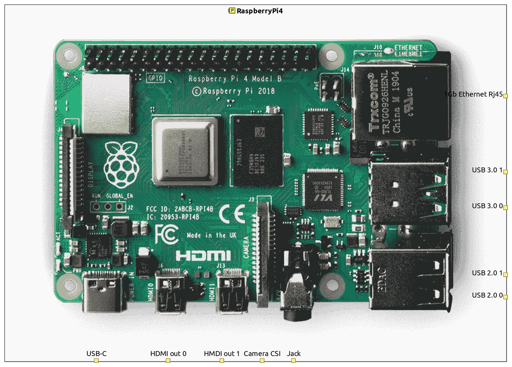

# RaspberryPi4_Capella
A Capella model of Raspberry Pi 4 in a library format for reusability.
The model focuses on the external interfaces of the Physical Architecture:
* HMDI ports
* Ethernet port
* Audio port
* Camera CSI port
* USB ports

## Requirements
* Capella 5.2.0
